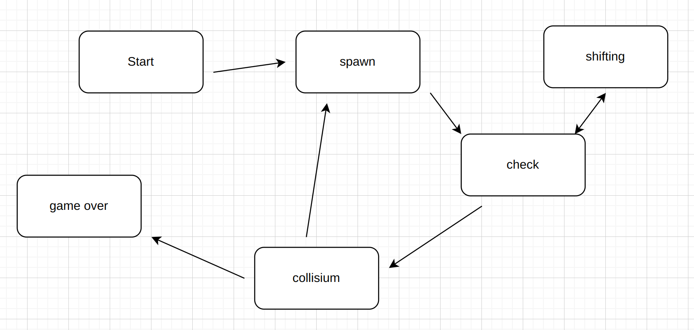

# BrickGame

Тетрис и змейка написана на языке С++ в терминальной версии используется ncurses и в Desktop-ной версии с использованием Qt. В змейке использовался паттерн MVC.

## Current State Machine

Конечный автомат для тетриса и змейки

### FSM TETRIS

#### START

С состояния start можной перейти в состояние game или выйти из игры, в зависимости от оброботки активных клавиш.

#### GAME

##### Painting
Состояние game отрисовывает рандомную фигуру.
Происходит обработка активных клавиш движения или поворота фигуры.
##### Move
Фигура перемещается на одну клетку вниз, после чего проверяется произошло столкновение или нет. Если произошло столкновение.
Проверяется заполнились линии или нет, если хотя бы одна линия заполнилась, происходит удаление линии и подчёт очков. Потом проверяется на заполнение верхних линий, если не хватает свободных линий на следующую фигуру, то состояние меняется на game over.

#### GAMEOVER

Конец игры.

### FSM SNAKE

#### START

С состояния start можной перейти в состояние game или выйти из игры, в зависимости от оброботки активных клавиш.

#### GAME
##### STARTING POSITION
Состояние отрисовывает яблоко. Происходит обработка активных клавиш движения если была нажатак активная клавиша, то змейка ускоряется в сторону которую смотрит. После чего если произошло определенной количество тиков.

##### SHIFTING

Фигура перемещается на одну клетку , после чего проверяется произошло столкновение или нет. Если произошло столкновение игра заканчивается если это яблоко игра продолжается.

#### GAMEOVER
 Происходит подчёт очков.

Конец игры.

## УПРВЛЕНИЕ

KEY_LEFT - движение влево

KEY_ RIGHT - движение вправо

KEY_UP - движение вверх

KEY_DOWN - движение вниз

SPACE - атвивная кнопка

X - пауза

ENTER - старт

ESC - выход из программы